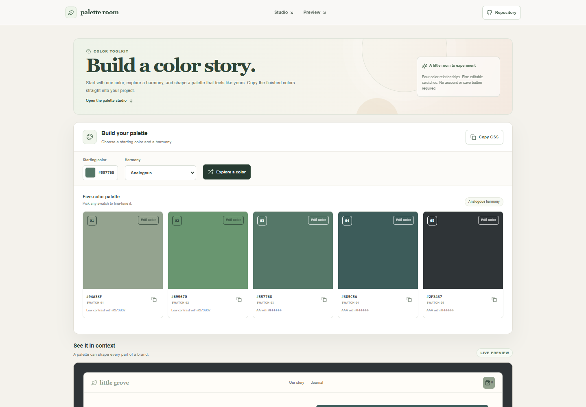

# Color Palette Studio

Palette Room is a small browser-based color workspace for exploring five-color palettes. Choose a starting color, compare harmony schemes, adjust individual swatches, and preview how the colors work together in a sample storefront.

**Live app:** [https://a2rp.github.io/color-palette-studio/](https://a2rp.github.io/color-palette-studio/)

## What is included

- A fixed header with links to the palette studio, the live preview, and this project's source repository.
- A color picker for choosing the starting color.
- Four harmony modes: analogous, complementary, triadic, and split complementary.
- Five generated swatches. The selected starting color is kept in the center swatch.
- A random color action for quickly exploring another starting point.
- A color picker on each swatch for manually refining the generated palette.
- A contrast label on every swatch. The label reports the stronger of white or dark text and marks whether that color reaches AA, AAA, or neither.
- A copy control on each swatch and a **Copy CSS** action for exporting the palette as `--palette-1` through `--palette-5` custom properties.
- A live storefront preview. Editing any swatch immediately updates the matching sample colors and adjusts sample text for readability.
- A footer with the source repository, portfolio, social profiles, email, and support links.
- A **Back to top** control that appears after scrolling more than 50 pixels.

## Using the palette studio

Choose a starting color with the color picker. Select a harmony from the menu, or use **Explore a color** to generate a random starting point. The five swatches update immediately. Choose any swatch to fine-tune it, then use its copy button to copy that hex value. **Copy CSS** copies the current five colors as CSS variables that can be pasted into a stylesheet.

The storefront preview below the editor uses the current swatches, so edits can be checked against text, buttons, and decorative surfaces. Contrast labels compare each swatch with white and dark text; they are a guide for the swatch itself and do not analyze an entire design or guarantee accessible combinations in other contexts.

## Data and limits

The app runs in the browser and does not send palette data to a server. It does not save palettes between visits, so a page refresh restores the default color and analogous scheme. Manual swatch edits remain active while the page is open, and changing the starting color or harmony generates a fresh palette. Colors use six-digit hex values. Copy actions use the browser clipboard API and may require a secure browser context and clipboard permission.

## Run locally

```sh
npm install
npm run dev
```

## Checks and deployment

```sh
npm run lint
npm test
npm run build
npm run deploy
```

The deploy script builds the app and publishes the `dist` folder to the `gh-pages` branch. The live site is [https://a2rp.github.io/color-palette-studio/](https://a2rp.github.io/color-palette-studio/).

## Future improvements

These are ideas that are not implemented yet:

- Save named palettes in local storage and restore them after a refresh.
- Export palettes as JSON, SVG swatch sheets, or image files.
- Add a full WCAG contrast checker for selected foreground and background pairs.
- Support additional harmony rules and adjustable palette sizes.

## Links

- Portfolio: [https://www.ashishranjan.net](https://www.ashishranjan.net)
- GitHub: [https://github.com/a2rp](https://github.com/a2rp)
- CodePen: [https://codepen.io/ash1198](https://codepen.io/ash1198)
- LinkedIn: [https://www.linkedin.com/in/aashishranjan](https://www.linkedin.com/in/aashishranjan)
- Facebook: [https://www.facebook.com/theash.ashish/](https://www.facebook.com/theash.ashish/)
- YouTube: [https://www.youtube.com/@ashishranjan-ashz?sub_confirmation=1](https://www.youtube.com/@ashishranjan-ashz?sub_confirmation=1)
- Email: [mailto:ash.ranjan09@gmail.com](mailto:ash.ranjan09@gmail.com)

## Support

- Support: [https://a2rp-donation-page.netlify.app/](https://a2rp-donation-page.netlify.app/)
- Buy Me a Coffee: [https://buymeacoffee.com/ashishranjan](https://buymeacoffee.com/ashishranjan)
- Patreon: [https://www.patreon.com/ashishranjan](https://www.patreon.com/ashishranjan)
